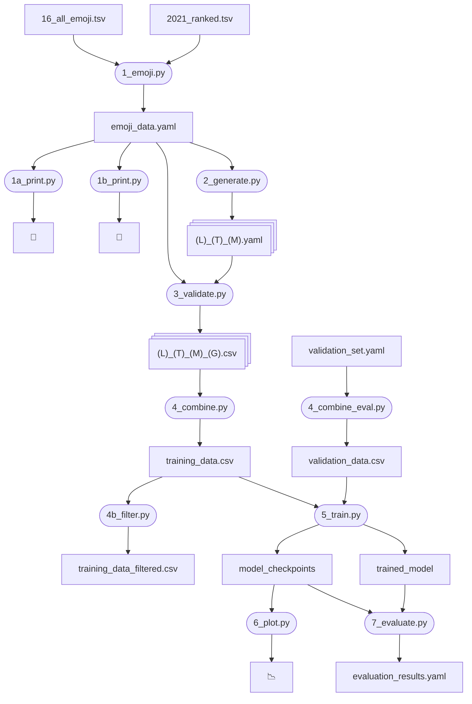

```mermaid
graph TD
    16_all_emoji_tsv[16_all_emoji.tsv]
    2021_ranked_tsv[2021_ranked.tsv]
    emoji_data_yaml[emoji_data.yaml]
    terminal_1[📄]
    terminal_2[📄]
    generated_data_yaml@{shape: procs, label: "(L)\\_(T)\\_(M).yaml"}
    generated_data_graded_csv@{shape: procs, label: "(L)\\_(T)\\_(M)\\_(G).csv"}
    training_data_csv[training_data.csv]
    validation_set_yaml[validation_set.yaml]
    validation_data_csv[validation_data.csv]
    training_data_filtered_csv[training_data_filtered.csv]
    chart[📉]
    model_checkpoints[model_checkpoints]
    trained_model[trained_model]
    evaluation_results[evaluation_results.yaml]

    s_1([1_emoji.py])
    16_all_emoji_tsv --> s_1
    2021_ranked_tsv --> s_1
    s_1 --> emoji_data_yaml

    s_1a([1a_print.py])
    emoji_data_yaml --> s_1a
    s_1a --> terminal_1

    s_1b([1b_print.py])
    emoji_data_yaml --> s_1b
    s_1b --> terminal_2

    s_2([2_generate.py])
    emoji_data_yaml --> s_2
    s_2 --> generated_data_yaml

    s_3([3_validate.py])
    emoji_data_yaml --> s_3
    generated_data_yaml --> s_3
    s_3 --> generated_data_graded_csv

    s_4([4_combine.py])
    generated_data_graded_csv --> s_4
    s_4 --> training_data_csv

    s_4e([4_combine_eval.py])
    validation_set_yaml --> s_4e
    s_4e --> validation_data_csv

    s_4b([4b_filter.py])
    training_data_csv --> s_4b
    s_4b --> training_data_filtered_csv

    s_5([5_train.py])
    training_data_csv --> s_5
    validation_data_csv --> s_5
    %% training_data_filtered_csv --> s_5
    s_5 --> model_checkpoints
    s_5 --> trained_model

    s_6([6_plot.py])
    model_checkpoints --> s_6
    s_6 --> chart

    s_7([7_evaluate.py])
    model_checkpoints --> s_7
    trained_model --> s_7
    s_7 --> evaluation_results
```