# 🪄 **EmojiSummary**  
*Turn any text into the perfect emoji in one shot.*

A playful but practical experiment that **generates synthetic prompt-completion pairs, fine-tunes a base LLM, and returns a single emoji that best captures the sentiment of any text snippet.**  

Built to explore synthetic data generation and lightweight GPU training on accessible hardware.

EmojiSummary fine-tunes a Large Language Model (LLM) to predict the most fitting emoji for a given text. This is achieved by first generating a synthetic dataset that maps text to emojis, and then using this dataset to fine-tune the LLM.

## 🧪 Results

The following examples show the difference between the fine-tuned model and a control model prompted with 'Give the best emoji for this text'. The fine-tuned model summarizes the input text better and generates less tokens, resulting in the following cost savings.

| Fine-tuned | Control | Cost Savings | Text |
| --- | --- | --- | --- |
| 🍔 | 🌶️ | 24% | The secret to my burger recipe is to thinly slice jalapenos and onions and smash those into the burger patty |
| 🐟 | 🦈 | 18% | Most fish are cold-blooded, their body temperature varying with the surrounding water, though some large active swimmers like white shark and tuna can hold a higher core temperature. |
| 🐕 | 🐶 | 25% | Dogs walk with us through life, aging by our side - not just as pets, but as our most faithful friends |
## 🚀 How To Use

Run the scripts in this order to create the required data for each step:

1.  **Prepare Emoji Data**: `1_emoji.py`
2.  **Generate Synthetic Data**: `2_generate.py`
3.  **Validate Data**: `3_validate.py`
4.  **Combine Datasets**: `4_combine.py`, `4_combine_eval.py`
5.  **Train Model**: `5_train.py`, `6_plot.py`
6.  **Evaluate/Infer**: `7_evaluate.py` or `7_evaluate_inference.py`

### Scripts
| Script | Purpose |
| ------ | ------- |
| **1\_emoji.py** | Processes raw emoji TSV files into `emoji_data.yaml`, including categorization and ranking. |
| **1\_print.py** | Prints emojis from `emoji_data.yaml` to the terminal. |
| **2\_generate.py** | Creates synthetic text linked to emojis using teacher LLMs, outputting to YAML files. |
| **3\_validate.py** | Validates the LLM-generated text-emoji pairs using another LLM as a grader, saving valid pairs to CSV. |
| **4\_combine.py** | Merges validated CSVs, filters for common rows, shuffles, and creates `training_data.csv`. |
| **4\_combine\_eval.py** | Converts `validation_set.yaml` into a shuffled `validation_data.csv` for model evaluation. |
| **5\_train.py** | Fine-tunes an LLM (e.g., Llama 3.2) using the prepared datasets, saving checkpoints and the final model. |
| **6\_plot.py** | Visualizes training and evaluation loss curves from model checkpoints. |
| **7\_evaluate.py** | Evaluates trained models against a validation set, saving results to `results.yaml`. |

## 🤖 Synthetic Data

The fine-tuning is done with 100% synthetic data. For each Unicode emoji, a teacher LLM is prompted to generate text in various forms which represent the emoji. In order to generate high-quality and diverse data, multiple teacher models are utilized.

```mermaid
graph LR
    16_all_emoji_tsv[16_all_emoji.tsv]
    2021_ranked_tsv[2021_ranked.tsv]
    emoji_data_yaml[emoji_data.yaml]
    terminal_1((📄))
    terminal_2((📄))
    generated_data_yaml@{shape: procs, label: "(L)\\_(T)\\_(M).yaml"}
    generated_data_graded_csv@{shape: procs, label: "(L)\\_(T)\\_(M)\\_(G).csv"}

    s_1([1_emoji.py])
    16_all_emoji_tsv --> s_1
    2021_ranked_tsv --> s_1
    s_1 --> emoji_data_yaml

    s_1a([1a_print.py])
    emoji_data_yaml --> s_1a
    s_1a --> terminal_1

    s_1b([1b_print.py])
    emoji_data_yaml --> s_1b
    s_1b --> terminal_2

    s_2([2_generate.py])
    emoji_data_yaml --> s_2
    s_2 --> generated_data_yaml

    s_3([3_validate.py])
    emoji_data_yaml --> s_3
    generated_data_yaml --> s_3
    s_3 --> generated_data_graded_csv
```

Multiple languages and styles are used to generate a variety of sample text to train the LLM. In addition to English, a portion of training data is generated in other languages to add variety. Models are only prompted to generate content in languages that are offcially supported according to the developers.

| Model  | Params | Languages  | Notes  |
| ------ | ------ | ---------- | ------ |
| **Llama 3.1** | 7 B | German, French, Italian, Portuguese, Hindi, Spanish, Thai | Fast, English-centric; great for initial keyword prompts. |
| **Gemma 3**   | 7 B | Chinese, French, Spanish, Portuguese, German, Italian, Russian, Japanese, Korean, Vietnamese, Thai, Arabic, Hindi | Multilingual focus; balances creative wording. |
| **Qwen 2.5**  | 7 B | Chinese, French, Spanish, Portuguese, German, Italian, Russian, Japanese, Korean, Vietnamese, Thai, Arabic | Excels at Asian languages & emoji nuance. |

* 60 K emoji-text pairs generated across 14 languages
* Automatic grading filters out \~40 % low-quality pairs
* Final *training\_data.csv* ≈ **182 K** high-signal rows

## 🧠 Training

The generated data is inversed before training to fine-tune an LLM that predicts emojis from text.

```mermaid
graph LR
    generated_data_graded_csv@{shape: procs, label: "(L)\\_(T)\\_(M)\\_(G).csv"}
    training_data_csv[training_data.csv]
    validation_set_yaml[validation_set.yaml]
    validation_data_csv[validation_data.csv]
    %% training_data_filtered_csv[training_data_filtered.csv]
    chart((📉))
    model_checkpoints[model_checkpoints]
    trained_model[trained_model]
    evaluation_results[evaluation_results.yaml]

    s_4([4_combine.py])
    generated_data_graded_csv --> s_4
    s_4 --> training_data_csv

    s_4e([4_combine_eval.py])
    validation_set_yaml --> s_4e
    s_4e --> validation_data_csv

    %% s_4b([4b_filter.py])
    %% training_data_csv --> s_4b
    %% s_4b --> training_data_filtered_csv

    s_5([5_train.py])
    training_data_csv --> s_5
    validation_data_csv --> s_5
    %% training_data_filtered_csv --> s_5
    s_5 --> model_checkpoints
    s_5 --> trained_model

    s_6([6_plot.py])
    model_checkpoints --> s_6
    s_6 --> chart

    s_7([7_evaluate.py])
    model_checkpoints --> s_7
    trained_model --> s_7
    s_7 --> evaluation_results
```

### Specifications

* **Hardware**  RTX 3070 (8 GB VRAM)
* **Base**  `Llama 3.2-8B-Instruct` (4-bit QLoRA)
* **Optimizer**  AdamW (1e-4)
* **Batch size**  512 tokens (gradient-accum ×8)
* **Epochs**  3 (≈ 8 hours)

## 📅 Future Work

* Expand text styles and languages.
* Experiment with more LLMs.
* Improve data validation.
* Explore multi-emoji predictions.

## 📜 License

[Llama](https://www.llama.com/llama3_1/license/)

[Apache 2.0](LICENSE)

## 🙏 Acknowledgements

*Built with Llama • Gemma • Qwen*

* [Unsloth](https://github.com/unslothai/unsloth) for painless QLoRA.
* [Ollama](https://ollama.ai) for local model routing.
* [Gemini Fine-Tuning](https://ai.google.dev/gemini-api/docs/model-tuning) for remote experiments.

> “An emoji is worth a thousand words.” — Someone
